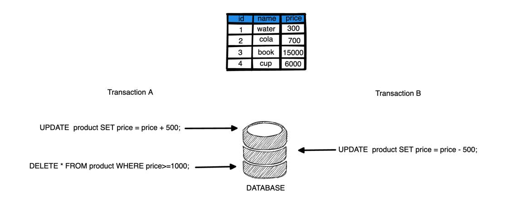
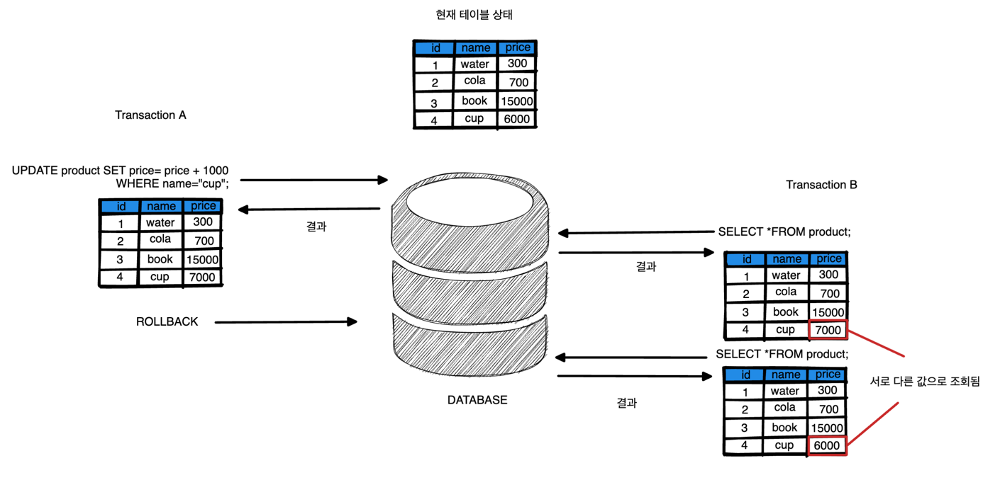
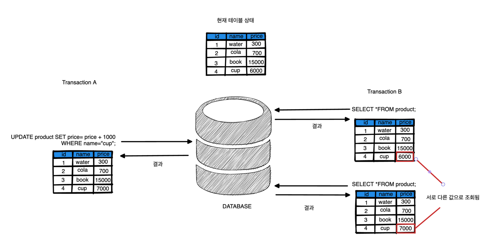
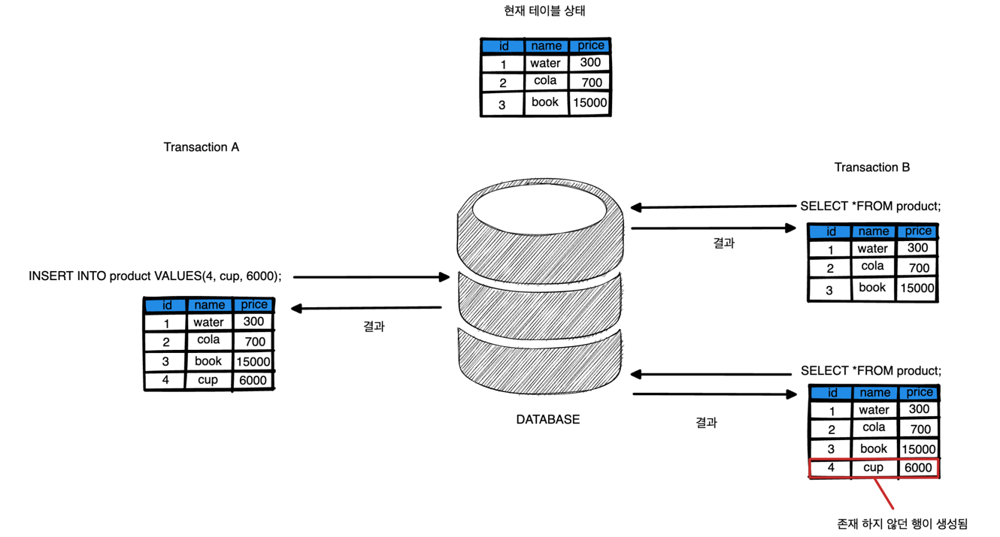
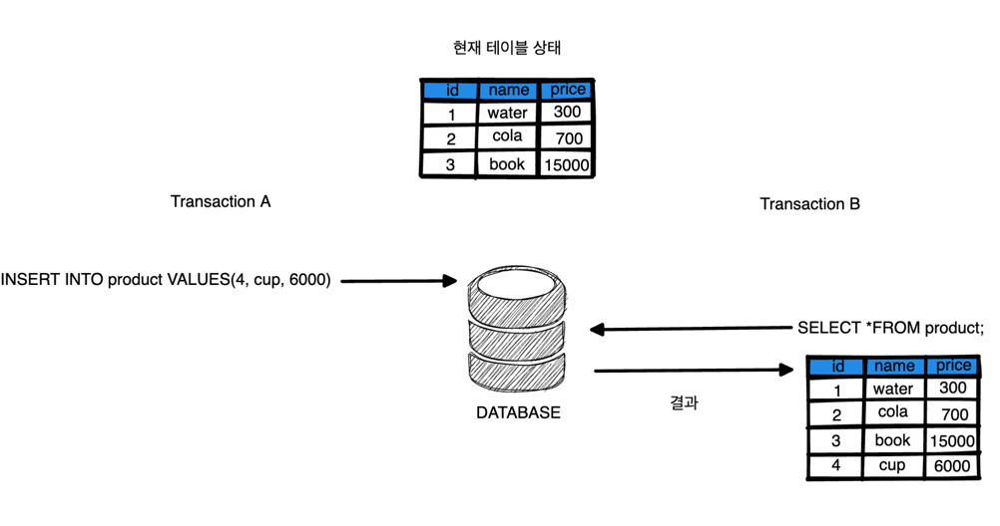
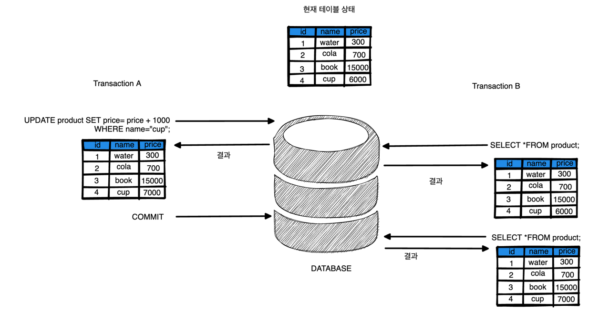
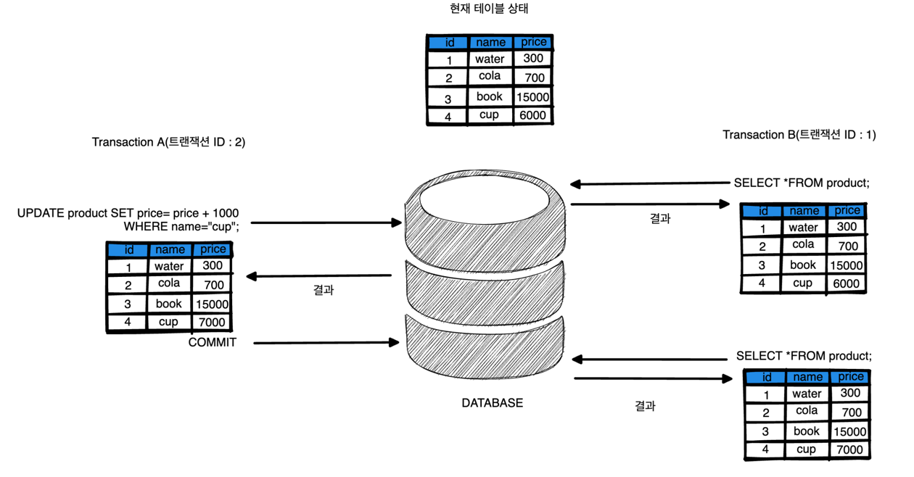
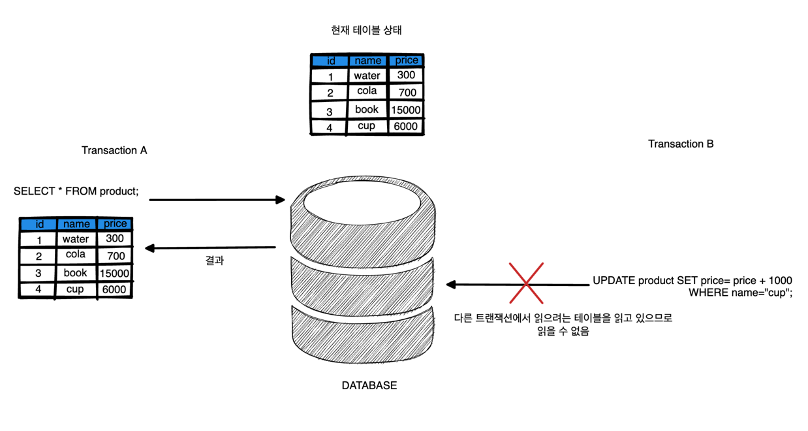

# 트랜잭션 격리 수준

## 트랜잭션 격리 수준이란?
동시에 여러 트랜잭션이 처리될 때 특정 트랜잭션이 다른 트랜젹션에서 변경하거나 조회한 데이터를 볼 수 있도록 허용 여부를 결정하는 것을 의미합니다.

## 트랜잭션 격리 수준이 필요한 이유
트랜잭션이 시작된 시점부터 일관성 있게 데이터를 읽기 위해 하나의 트랜잭션이 진행되는 동안 다른 트랜잭션에 의해 변경사항이 발생하더라도 이를 무시하고 계속 일관성있는 데이터를 보여주기 위해 사용됩니다.

예를 들어 다음과 같이 상품 테이블이 존재하고 이를 조작하는 두개의 트랜잭션이 존재한다고 가정해봅시다.



현재 A 트랜잭션에서는 값을 500을 더하고 1000원 이상인 상품을 전부 테이블에서 제거하게 됩니다.

A 트랜잭션에서 원하는 결과는 cola 상품에 500원이 더해져 water 상품을 제외한 행이 전부 삭제되는 상황입니다.

하지만 A 트랜잭션이 실행되는 중 중간에 B 트랜잭션이 500원을 감소시켜 cola 상품이 다시 700원으로 돌아가 water와 cola 상품이 남게됩니다.

트랜잭션 격리수준을 사용하면 이런 상황에 다른 트랜잭션에게 영향을 받지 않고 원하는 동작을 할 수 있게끔 만들 수 있습니다.

간단히 말하면 동시성 제어 문제를 해결하기 위해서 트랜잭션 격리 수준이 사용됩니다.

## 트랜잭션에서의 대표적인 동시성 제어 문제
### Dirty Read
Dirty Read 문제는 변경 후 아직 커밋되지 않은 값을 읽고, 롤백 후의 값을 다시 읽어 최종 결과 값이 상이한 현상을 말합니다.

예를 들어, 트랜잭션 A에서 값을 변경 후 변경한 값을 트랜잭션 B가 읽은 상태에서 트랜잭션 A가 어떤 문제로 인해 롤백되었을 때 결과 값이 달라지게 됩니다.
이런 현상을 Dirty Read라고 부릅니다.



### Non-Repeatable Read
한 트랜잭션 내에서 같은 쿼리를 두번 실행할 때, 그 사이에 다른 트랜잭션이 값을 수정 또는 삭제함으로써 두 쿼리가 서로 다르게 나타는 현상을 말합니다.


### Phantom Read
한 트랜잭션에서 같은 쿼리를 두번 실행했을 경우, 두 번째 쿼리에서 첫 번째 쿼리에서 없던 데이터가 나타나는 현상입니다.



Phantom Read를 방지하려면 쓰기 잠금을 걸어주어야 합니다.

이런 동시성 문제들을 트랜잭션 격리 수준을 통해 해결할 수 있습니다.

## 트랜잭션 격리 수준의 종류
- READ UNCOMMENTED (커밋되지 않은 읽기)
- READ COMMITED (커밋된 읽기)
- REPEATABLE READ (반복 가능한 읽기)
- SERIALIZABLE (직렬화 가능)


### READ UNCOMMITED (커밋되지 않은 읽기, level0)

READ UNCOMMITED는 각 트랜잭션의 변경 내용이 COMMIT/ROLLBACK 여부에 상관없이 다른 트랜잭션에서 읽을 수 있습니다.

쉽게 말해 아직 처리중인 트랜잭션에 대해 다른 트랜잭션이 읽을 수 있는 격리수준입니다.



격리 수준 중 제한이 가장 적기 때문에 비용이 제일 적게 들지만 다음과 같은 문제점이 존재합니다.

- 문제점
  - Dirty Read, Non-Repeatable Read, Phantom Read가 발생할 수 있습니다.
  - 데이터 정합성에 문제가 생길 가능성이 높으므로 되도록 사용하지 않는 것이 좋습니다. (RDBMS 표준에서는 격리수준으로 인정하지 않음)

READ UNCOMMITED의 경우 다음과 같은 상황에는 사용해도 무관합니다.
- 더 이상 갱신되지 않는 자료를 열람하는 경우
- 일부가 제대로 조회되지 않더라도 무관할 정도의 많은 양의 데이터를 어림잡아 집계할때
- 복잡한 stored procedure나 함수가 포함된 디버깅을 할 때 중간과정을 확인하기 위해 사용할 수 있음


### READ COMMITED (커밋된 읽기, level1)
READ COMMITED는 대부분의 RDB에서 기본으로 사용되고 있는 격리수준으로, COMMIT 된 데이터만 보이는 수준의 격리수준입니다.




트랜잭션이 COMMIT 되어 확정된 데이터만 읽기 때문에 Dirty Read는 발생하지 않지만 다음과 같은 문제가 존재합니다.

- 문제점
  - Non-Repeatable Read가 발생할 수 있습니다.
  - Phantom Read가 발생할 수 있습니다.
  - 트랜잭션간 고립성을 완전히 보장하지 못합니다.

READ_COMMITED 같은 경우 DBMS 종류에 따라 구현 방식의 차이가 있습니다.
- IBM DB2, SQL Server, SyBase의 경우 읽기, 공유 Lock을 이용하여 구현
- Oracle, MySQL 같은 경우 Undo 영역에 백업된 데이터를 가져옴

```shell
Q.  Undo 영역이란 무엇인가요?

A.  사용자가 DML을 수행할 경우 발생하는 원본 데이터를 Undo Data라고 하며, 
    Undo 영역은 이러한 데이터가 저장되는 공간입니다.
```


### REPEATABLE READ (반복 가능한 읽기, level2)
REPEATABLE READ는 MySQL의 InnoDB 스토리지 엔진에서 기본적으로 사용되는 격리 수준으로, 트랜잭션이 시작되기 전에 COMMIT된 내용에 대해서만 조회할 수 있습니다.


MySQL의 경우 트랜잭션마다 트랜잭션 ID를 부여하여 해당 ID보다 작은 트랜잭션 번호에서 변경한 것만 읽는 방식으로 동작합니다.

변경 전 데이터는 Undo 영역에 백업해두고 실제 데이터 값을 변경하게 됩니다.

- 문제점
  - Phantom Read가 발생할 수 있습니다. (Insert에 대해서 쓰기 잠금은 걸리지 않기 때문에)
  - 트랜잭션 시작 후 종료하지 않을 경우 UNDO 영역이 계속해서 커지면서 DB의 성능이 저하될 수 있습니다.
  - 트랜잭션이 완료될 때까지 SELECT 문장이 사용하는 모든 데이터에 공유 잠금(Shared Lock)이 걸리므로 다른 트랜잭션은 해당 되는 데이터에 대해 수정이 불가능합니다.
  
### SERIALIZABLE (직렬화 가능, level3)
SERIALIZABLE은 어떤 트랜잭션이 특정 테이블을 읽고 있는 경우 공유 잠금(shared lock)을 걸어 

가장 엄격하고 단순한 격리수준으로 Dirty Read, Phantom Read 등의 동시성 문제가 발생하지 않습니다.



- 문제점
  - 공유 잠금으로 테이블의 수정을 막기 때문에 동시 처리 능력이 다른 격리수준보다 떨어지기 때문에 잘 사용되지 않습니다.
